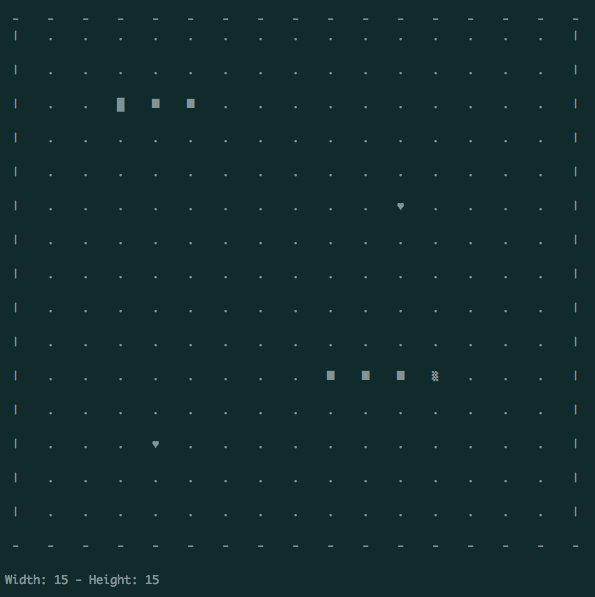
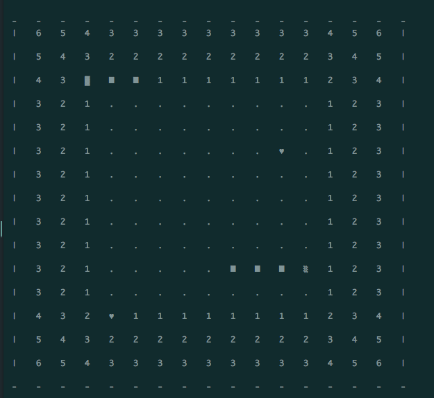
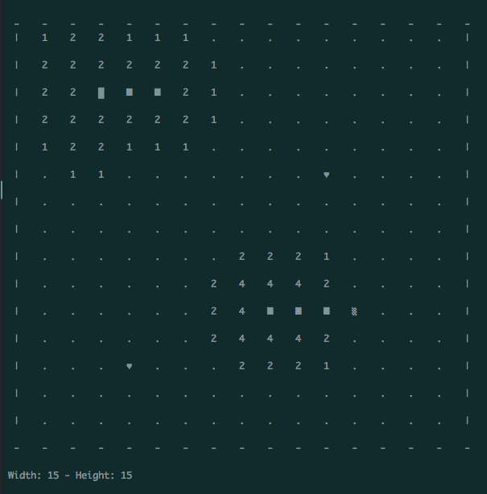
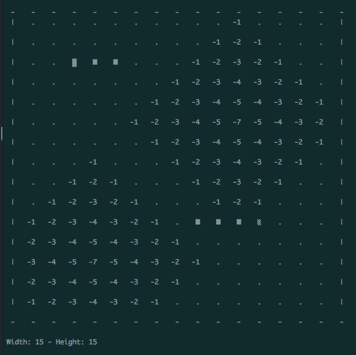
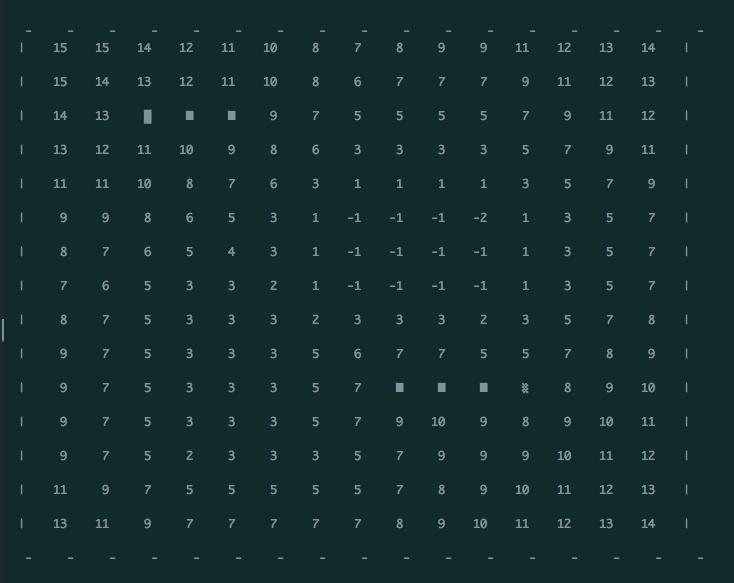
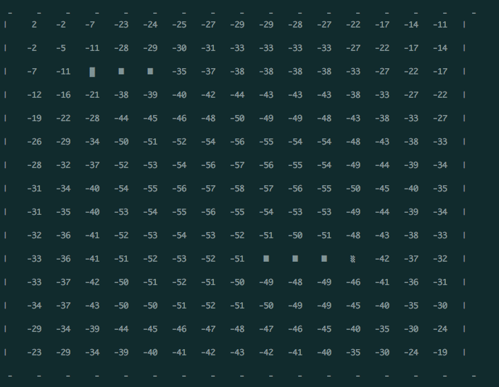
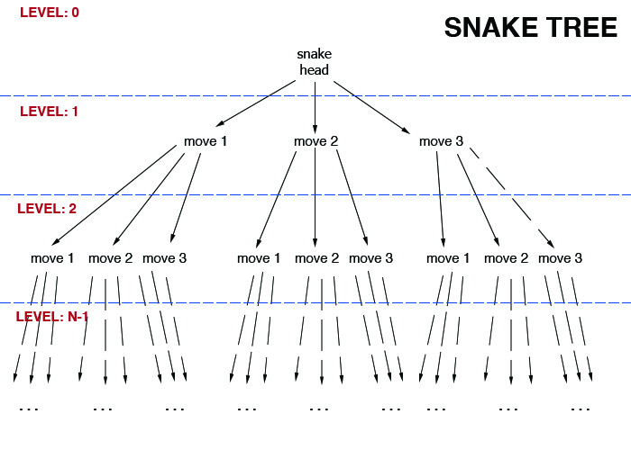

# BattleSnake 2017

In 2017, I competed in Victoria's annual <a href="https://github.com/sendwithus/battlesnake">BattleSnake</a> competition in which competitors play the classic arcade game of snake: You have a snake and if you eat food then you get longer. The caveat of BattleSnake is there are other snakes on the board at the same time and your health decreases over time -- so you need to eat!

**How it works:** Players are given the state of the grid (where the snakes are, where the food is) each turn and are asked to simply respond with the direction they'd like to move their snake. 

## Constraints: 

* The response time has to be in 200 ms.

## My approach  

There are four main parts to my approach:

1.  **Grid**: Make a grid layout of the current state of the game that I can interpret. 

2. **Paint** The grid: With the grid layout defined (#1), assign weighted values on the grid based on importance of different objects: food, enemy snakes, my snake, and walls.

3. Build a **Tree**: Starting with the head of my snake as the top node, construct a tree that documents the possible paths the snake can more.

4. Hire a **Squirrel**: Traverse the tree you've built and determine the best path to take. 

### Conclusions:

My initial thinking was that the strength of the method would be directly proportional to the depth of the tree (#3). However, because there was an inforced resposne time of 200 ms, it simply was too costly to increase the depth (each level would mean 3^n more possible nodes, i.e: 1,3,9,27,81,243,729, 2187). Adding another level to the tree became too unweildly and it wasn't realistic given the constraints. The reality was, **the "painting of the grid" (#2) was by far the most important part.** If done correctly, I could ensure that my tree, no matter how many levels it had, would be influenced by all objects on the grid. 

I ended up winning my qualifier and moving to the semifinals automatically, but I came second in the semi's and didn't move onto the finals (so close!). 

<h3><a href="https://www.youtube.com/watch?v=_snSnHx6Irg">Click for video.</a></h3>

### Surprises: 

With the way I built my snake, using varying degree and weighting config variables (`config.rb`), it meant that I could easily make my snake more aggressive by making enemy snakes "more attractive". Having these config variables meant my algorithm was easily tunable for a specific scenario, which came in handy for some of the special bounty rounds during the day. 

## How each layer worked

### 1. The Grid (`grid.rb`)

This part is pretty straight forward. I'd receive data on the width and height of the grid, the coordinates of all the snakes, and the location of any food. With that information I made a basic grid that ended up being an array of arrays, i.e. Array[width][height]

Here's a visual way of understanding it:

### 2. Painting the Grid (`painter.rb`)

This part was surprisingly the most important. Each item on the grid was given a certain importance (config variables that I defined) and I "painted" the grid to reflect that. It's easier to see it visually first, I think:

##### Walls

##### Snakes

(enemy snake in top left; my snake bottom right)

##### Food

##### Combined

##### Combined with real config params

##### Combined with realistic float values

Each object has a radius of effect. What I realized is that all I need to do is make sure that radius extends to somewhere near the vacinity of my snake. That way, when I build a tree then all the objects would have an influence - my snake would feel the gravity of all the snakes/foods/walls on the field. 

### Painting the Walls

My thinking: Walls are dangerous. If you run into one then you die. It's better to stay farther away from them if you can. 

### Painting the Snakes

My thinking: There are two scenarios to consider: enemy snakes and my snake

* Enemy snakes are dangerous. Their heads are the most dangerous.

* My snake's body is more dangerous than open space. The area surrounding my snake's head is neutral.

**Important detail**: If one snake runs into another snake, then the larger of the two wins. If they're the same size then they both die. To account for that, based on a ratio of how much bigger or smaller an enemy snake was to mine, I painted around enemy snakes dynamically based on threat level. Specifically, if the snake and my snake are the same size the ratio was 1:1, if the enemy was bigger then the danger lavel would be between 1-2 times more than normal, if they were smaller then down to 0.8 of the normal danger level.  It wasn't a ton of influence, but it still counts. 

### Painting the Food

The importance of food was weighted inverse proportionately to how much life my snake had. That is to say, the lower my health, the more influence food had and the more likely I was to pursue it. I wrote an equation that exponentially increased as my percentage of health went from 100% to 0. 

(the equation I used)

### 3. Building the Tree of possible paths (`tree.rb`)

I did this recursively starting from the head of my snake. The level of the tree was defined in a config variable. 

Things I took into account were: 
* Paths that didn't overlap themselves (i.e. one that went in circles)
* Some paths ended early because there's no where to move next so you can't assume that, for LEVEL = N, all paths will have N nodes. 

#### My nodes

Each node contained:

* It's position on the grid
* The direction that was taken to reach it
* It's value on the painted grid
* The sum of all the values of nodes leading up to it
* A reference to it's parent
* An array of children

### 4. Find a Squirrel to Traverse the Tree (`squirrel.rb`)

I implemented two basic traversal methods:

* Depth First Search (simple)

* Breadth First Search (more interesting)

#### Depth First Search

This was actually quite easy. 

1. When making my tree, I kept track an array of all the "path end nodes" of a path (i.e. nodes that had no where else to move or nodes with LEVEL = N, where N was what I defined as my max tree depth). Since I had all of my "path end nodes", I selected all the ones with the highest level (for example if I had some nodes with level 5, 4, 3, etc. then I looked at only the ones with level 5), which made the assumption that longer paths are better, regardless. 

2. Then of those nodes, I selected the lowest sum. 

3. I recursively tracked the parents of that node until I got to the top of the tree, which told me if going left, right, up, or down lead to reaching that node. 

Advantages: Easy to implement. 

#### Breadth First Search

It was always my goal from the beginning to implement BFD. The primary reason was it would allow me to abandon paths that were too dangerous before pursuing them further. For example, if a path started really dangerously but ended in a safe zone then a depth first search traverse (looking at the end of the path first) would tell you that it was so-so or average path, but that's not true. 

With BFD, you can determine that a path was dangerous early on, so it was something to be disregarded even if it got better later. **The closer a node in tree is to the origin, the more important it is.** I really don't care as much about nodes farther from the tree because by the time my snake would have reached there, the grid would've been totally different anyways.  So I need a way giving more importance to nodes closer to the orgin node and BFD was my best bet. 

##### Abandoning paths with BFD

My initial thought was to set a fixed threshold for each level in a tree and drop those that went above the threshold. Instead, what ended up being much easier was ranking the nodes on each level, keeping a certain percentage of them and look at their children, and repeat the process until at the bottom of the tree. This enabled me to set relative thresholds based on percent (much easier imo).

So as an example:

On the 3rd level of my tree I have 27 nodes. I rank them by their sum and if they have children (remember, longer paths are better so we want them to have children). After ranking them, I take the top 60% and disregard the rest. Of the 60% that I kept, I collect their children and do the same. 

## Improvements

* The way food is "painted" is not ideal. What would be better is some sort of ray tracing, like an A* algorithm. The issue right now is the influence of food passes through snakes, which means my snake might sometime turn in on itself thinking it's the best path. 

* Genetic learning algorithm, those constants in my config.rb could easily be trained. 

* Enemy-in-corner detection so that I could cut them off. 

* Optimizing speed

* There are so many other ideas that I have, but I won't list them all here.

## Thanks

* To everyone who made the event happen!
* To Matt, R. Selk, and anyone else who gave me advice.

